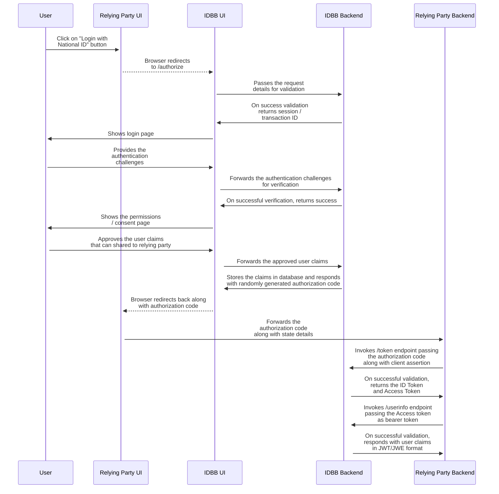
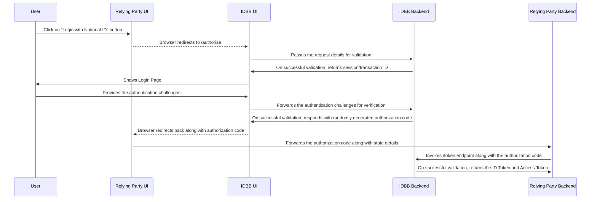
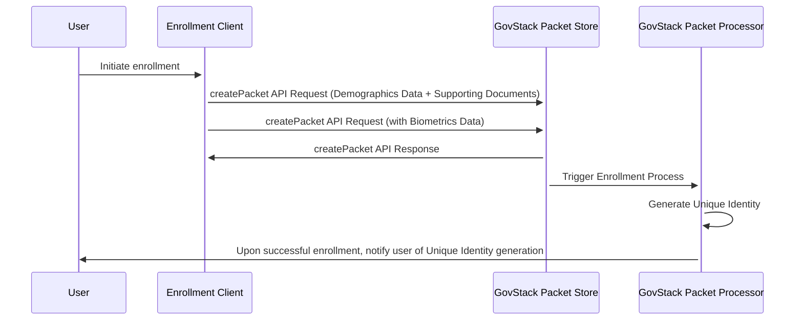
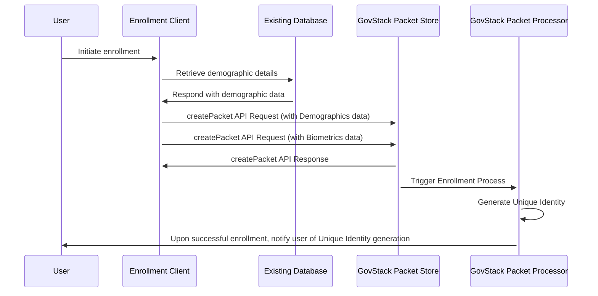

# 9 Internal Workflows

If GovStack will offer global workflow management for cross-building block use cases, Identity and Verification Building Block will have its internal workflows for its own internal business flows execution.

Non-exhaustive list of examples:

* For onboarding a new individual.
* For managing identity changes after an event on a person's identity (name change, death, etc.).
* For life cycle management of an individual's identity evidence (i.e. ID Cards).
* For management of access rights to services on an individual's data.

Those workflows will be described in a later version.

### 9.1 Identity Verification Workflow

The below workflow details the steps involved in the relying party application enabling the end user to log in using their National ID. Once the login process is completed, Identity Building Block also allows the relying party to get verified user claims based on explicit permission from the end user.

#### 9.1.1 Verification with user claims

The steps are:

* The relying party wants to authenticate the user to the Identity Building Block.
* The relying party redirects the user to the Identity Building Block UI.
* The user will authenticate on the Identity Build block.
* The Identity Build Block will ask the user permission to share his/her personal data.
* The User selected the attributes he/she accepts to share.
* A code is generated and returned by the Identity Building Block to the relying party.
* The relying party uses the code and receives an ID token and an access token.
* The relying party then uses the access token to receive the user information.
* The user can pursue its application within the relying party UI.

<figure><figcaption></figcaption></figure>

#### 9.1.2 Verification without user claims

If the relying party wants to verify the identity of the end user without user information, then a lean workflow can be adopted. The steps of lean flow are similar to the workflow steps in previous section. However, during /authorize API call, the scope is set to "openid". This informs the IDBB UI that no user claims will be accessed and thus IDBB UI doesn't show any consent page and these steps are skipped in the workflow.

### 9.2 Identity Management Workflow

The enrollment process differs from country to country and the enrollment data collection can be done in-person, or ported from existing servers. Here sample workflows are shown.&#x20;

#### 9.2.1 Enrollment Workflow (Fresh Enrollment)

These are the sample steps for fresh enrollment where the enrollment data is collected afresh:

1. User goes to the Enrollment office.&#x20;
2. The Enrollment Client collects user demographic details and supporting documents and calls the createPacket API of GovStack Packet Store.
3. Enrollment Client collects user bio-metric details and calls createPacket API of GovStack Packet Store.
4. Once all the enrollment data is available at the GovStack Packet Store, it triggers the enrollment process in GovStack Packet Processor.
5. GovStack Packet Processor processes the data and generates Unique Identity for the user.
6. The user is notified of successful enrollment and the receives the Unique Identity by mail.

#### Enrollment Workflow (Enrollment with existing database)

These are the steps for enrollment using existing data, in which the demographic details are collected from an existing database and biometric data is collected afresh.

1. User goes to the Enrollment office.&#x20;
2. Enrollment Client retrieves the user demographic details and supporting documents from an existing database and calls createPacket API of GovStack Packet Store.
3. Enrollment Client collects user biometric details afresh and calls createPacket API of GovStack Packet Store.
4. Once all the enrollment data is available at the GovStack Packet Store, it triggers the enrollment process in GovStack Packet Processor.
5. GovStack Packet Processor processes the data and generates Unique Identity for the user.
6. The user is notified of successful enrollment and the receives the Unique Identity by mail.

